# THIS IS THE BACKEND

## Logical Data Model

You can modify this model on [www.mermaid.com](https://www.mermaidchart.com/).

```
erDiagram
    USER {
        int user_id PK
        string phone_number
        string name
        string username
        string status_message
        datetime last_seen_at
        datetime created_at
    }

    CHAT {
        int chat_id PK
        datetime created_at
        int last_message_id FK
    }

    CHAT_PARTICIPANT {
        int chat_id FK
        int user_id FK
        datetime joined_at
        boolean is_muted
    }

    MESSAGE {
        int message_id PK
        int chat_id FK
        int sender_id FK
        string message_type
        string content
        datetime sent_at
    }

    MESSAGE_STATUS {
        int message_id FK
        int user_id FK
        string status
        datetime updated_at
    }

    USER_DEVICE {
        int device_id PK
        int user_id FK
        string device_type
        datetime last_active_at
    }

    USER ||--o{ CHAT_PARTICIPANT : participates
    CHAT ||--o{ CHAT_PARTICIPANT : has

    CHAT ||--o{ MESSAGE : contains
    USER ||--o{ MESSAGE : sends

    MESSAGE ||--o{ MESSAGE_STATUS : has
    USER ||--o{ MESSAGE_STATUS : receives

    USER ||--o{ USER_DEVICE : uses
```

The result


## DO ON NEXT PROJECT

- [ ] check types of Authorization Systems (time authentication, risk-based authentication, role-base authentication) also check zero-trust as code

- [ ] add packages for exception handling in django rest framework (link)[https://freedium-mirror.cfd/https://python.plainenglish.io/third-party-packages-for-exception-handling-in-django-rest-framework-137271243933].
